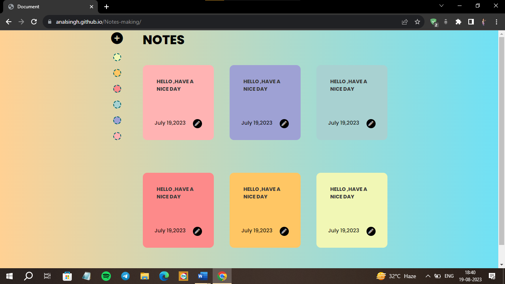

# Notes-Making Website

Welcome to the Notes-Making Website! This simple yet powerful web application allows you to create, edit, and manage your notes effortlessly. With an intuitive user interface and a responsive design, organizing your thoughts has never been easier.

## Table of Contents

- [Features](#features)
- [Usage](#usage)
- [Demo](#demo)

## Features

- **Add Notes**: Click the "Add Card" button to create a new note card. Choose from a selection of color themes to categorize and personalize your notes.

- **Edit Notes**: To update your notes, simply click the pencil icon (edit) on a note card. You can modify the content as needed.

- **Responsive Design**: The website's responsive design ensures a seamless user experience across various devices, including desktops, tablets, and mobile phones.

- **Intuitive UI**: The user-friendly interface streamlines the note-taking process, making it efficient and enjoyable.

## Usage

1. **Adding a Note**:

   - Click the "Add Card" button (represented by a plus icon) to create a new note.
   - Customize your note by selecting a color theme from the available options.
   - Your newly created note card will appear on the right side of the page.

2. **Editing a Note**:

   - Click the pencil icon (edit) on the respective note card to edit an existing note.
   - The note's content becomes editable, allowing you to make changes.
   - Save your edits by clicking the checkmark icon, or cancel the edit by clicking the cross icon.

3. **Deleting a Note**:

   - If you wish to delete a note, click the trash icon (bin) on the note card.
   - A confirmation prompt will appear; confirm to delete the note permanently.

## Demo

To experience the Notes-Making Website, simply visit the (https://analsingh.github.io/Notes-making/) and start organizing your thoughts with ease.

Feel free to customize this README.md file further to include any specific details about your development environment, dependencies, or any other relevant information related to your project.
